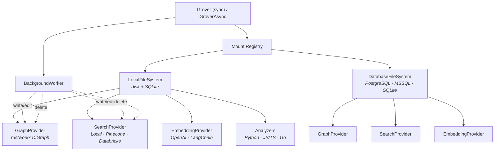

[](https://pypi.org/project/grover/)
[](https://pypi.org/project/grover/)
[](https://github.com/ClayGendron/grover/blob/main/LICENSE)

# Grover

**The agentic filesystem.** Safe file operations, knowledge graphs, and semantic search — unified for AI agents.

> **Alpha** — Grover is under active development. The core API is functional and tested, but expect breaking changes before 1.0.

Grover gives AI agents a single toolkit for working with any knowledge base — documents, codebases, research, datasets, or any collection of files:

- **Versioned filesystem** — mount local directories or databases, write safely with automatic versioning, and recover mistakes with soft-delete trash and rollback.
- **Knowledge graph** — predecessor, successor, and containment queries powered by [rustworkx](https://github.com/Qiskit/rustworkx). Add edges manually or let built-in analyzers extract structure automatically (Python via AST; JS/TS/Go via tree-sitter).
- **Semantic search** — pluggable vector stores (local [usearch](https://github.com/unum-cloud/usearch), [Pinecone](https://www.pinecone.io/), [Databricks](https://docs.databricks.com/en/generative-ai/vector-search.html)) with pluggable embedding providers (OpenAI, LangChain). Search by meaning, not just keywords.

All three layers stay in sync — write a file and the graph rebuilds and embeddings re-index automatically in the background.

The name comes from **grove** (a connected cluster of trees) + **rover** (an agent that explores). Grover treats your data as a grove of interconnected files and lets agents navigate it safely.

## Installation

```bash
pip install grover
```

Optional extras:

```bash
pip install grover[search]       # usearch (local vector search)
pip install grover[openai]       # OpenAI embeddings
pip install grover[pinecone]     # Pinecone vector store
pip install grover[databricks]   # Databricks Vector Search
pip install grover[treesitter]   # JS/TS/Go code analyzers
pip install grover[postgres]     # PostgreSQL backend
pip install grover[mssql]        # MSSQL backend
pip install grover[deepagents]   # deepagents/LangGraph integration
pip install grover[langchain]    # LangChain retriever + document loader
pip install grover[langgraph]    # LangGraph persistent store
pip install grover[all]          # everything
```

Requires Python 3.12+.

## Quick start

```python
from grover import Grover
from grover.backends.local import LocalFileSystem

# Create a Grover instance (state is stored in .grover/)
g = Grover()

# Mount a local project directory
backend = LocalFileSystem(workspace_dir="/path/to/project")
g.add_mount("/project", filesystem=backend)

# Write files — every write is automatically versioned
# Indexing happens in the background (graph + search update asynchronously)
g.write("/project/hello.py", "def greet(name):\n    return f'Hello, {name}!'\n")
g.write("/project/main.py", "from hello import greet\nprint(greet('world'))\n")

# Read and edit
content = g.read("/project/hello.py")
g.edit("/project/hello.py", "Hello", "Hi")

# Wait for background indexing to complete before querying
g.flush()

# Knowledge graph queries
g.successors("/project/main.py")     # what does main.py depend on?
g.predecessors("/project/hello.py")  # what depends on hello.py?
g.contains("/project/hello.py")      # functions and classes inside

# Graph algorithms (centrality, subgraph extraction)
scores = g.pagerank()                                     # PageRank centrality
sub = g.meeting_subgraph(["/project/a.py", "/project/b.py"])  # connecting subgraph
nodes = g.find_nodes(lang="python")                       # filter by attributes

# Semantic search (requires embedding + search providers)
from grover.providers.search import LocalVectorStore
from grover.providers.embedding import OpenAIEmbedding

g2 = Grover()
g2.add_mount("/project", filesystem=backend,
             embedding_provider=OpenAIEmbedding(model="text-embedding-3-small"),
             search_provider=LocalVectorStore(dimension=1536))
result = g2.vector_search("greeting function", k=5)
for candidate in result.file_candidates:
    print(candidate.path)

# Or use index() for a full one-time scan (useful with manual mode)
stats = g.index()
# {"files_scanned": 42, "chunks_created": 187, "edges_added": 95, "files_skipped": 3}

# Delete (soft-delete — recoverable from trash)
g.delete("/project/main.py")

# Persist and clean up
g.save()
g.close()
```

A full async API is also available:

```python
from grover import GroverAsync

g = GroverAsync()
await g.add_mount("/project", filesystem=backend)
await g.write("/project/hello.py", "...")
await g.flush()   # wait for background indexing before querying
await g.save()
await g.close()
```

For batch imports where you want to write many files before indexing, use manual mode:

```python
from grover import Grover, IndexingMode

g = Grover(indexing_mode=IndexingMode.MANUAL)
g.add_mount("/project", filesystem=backend)

# Write many files — no background indexing
for path, content in files:
    g.write(path, content)

# Index everything at once
g.index()
g.close()
```

## Architecture

Grover is composed of three layers that share a common identity model — every node in the graph and every entry in the search index is a file path. All capabilities live as **providers** on the filesystem.



**Mount Registry** routes operations to the right backend based on mount paths. Multiple backends can be mounted simultaneously.

**Filesystem providers** live on each backend. `GraphProvider` (a `RustworkxGraph`) maintains an in-memory directed graph of file dependencies. `SearchProvider` (`LocalVectorStore`, `PineconeVectorStore`, or `DatabricksVectorStore`) stores and searches vectors. `EmbeddingProvider` (`OpenAIEmbedding`, `LangChainEmbedding`) converts text to vectors. Code analyzers automatically extract imports, function definitions, and class hierarchies.

**BackgroundWorker** keeps everything consistent — when a file is written or deleted, the graph and search index update automatically in the background. Work is debounced per-path so rapid writes to the same file are coalesced into a single analysis pass.

## Backends

Grover supports two storage backends through a common protocol:

**LocalFileSystem** — for desktop development and code editing. Files live on disk where your IDE, git, and other tools can see them. Metadata and version history are stored in a local SQLite database. This is the default for local projects.

**DatabaseFileSystem** — for web applications and shared knowledge bases. All content lives in the database (PostgreSQL, MSSQL, or SQLite). There are no physical files. This is ideal for multi-tenant platforms, enterprise document stores, or any environment where state should be centralized.

Both backends support versioning and trash. You can mount them side by side:

```python
from grover import EngineConfig
from grover.backends import LocalFileSystem

g = Grover()

# Local code on disk
g.add_mount("/code", filesystem=LocalFileSystem(workspace_dir="./my-project"))

# Shared docs in PostgreSQL
g.add_mount("/docs", engine_config=EngineConfig(url="postgresql+asyncpg://localhost/mydb"))
```

### User-scoped mounts

For multi-tenant deployments, mount a `UserScopedFileSystem` to enable per-user namespacing:

```python
from grover import EngineConfig
from grover.backends.user_scoped import UserScopedFileSystem

g = GroverAsync()
backend = UserScopedFileSystem()
await g.add_mount("/ws", filesystem=backend,
                  engine_config=EngineConfig(url="postgresql+asyncpg://localhost/mydb"))

# Each user has their own namespace
await g.write("/ws/notes.md", "hello", user_id="alice")
await g.write("/ws/notes.md", "world", user_id="bob")
r1 = await g.read("/ws/notes.md", user_id="alice")  # "hello"
r2 = await g.read("/ws/notes.md", user_id="bob")  # "world"

# Share files between users
await g.share("/ws/notes.md", "bob", user_id="alice")
r3 = await g.read("/ws/@shared/alice/notes.md", user_id="bob")  # "hello"
```

### deepagents integration

Use Grover as a storage backend for [deepagents](https://github.com/langchain-ai/deepagents) (LangGraph agent framework):

```python
from grover.integrations.deepagents import GroverBackend, GroverMiddleware

# GroverBackend implements deepagents BackendProtocol
backend = GroverBackend.from_local("/path/to/workspace")

# GroverMiddleware adds version, search, graph, and trash tools
middleware = [GroverMiddleware(backend.grover)]
```

Requires the `deepagents` extra: `pip install grover[deepagents]`

### LangChain / LangGraph integration

Use Grover as a LangChain retriever, document loader, or LangGraph persistent store:

```python
from grover.integrations.langchain import GroverRetriever, GroverLoader, GroverStore

# Retriever — semantic search as a LangChain retriever
retriever = GroverRetriever(grover=g, k=5)
docs = retriever.invoke("authentication logic")

# Loader — stream files as LangChain Documents
loader = GroverLoader(grover=g, path="/project", glob_pattern="*.py")
docs = loader.load()

# Store — LangGraph persistent memory backed by Grover
store = GroverStore(grover=g, prefix="/data/store")
store.put(("users", "alice"), "prefs", {"theme": "dark"})
item = store.get(("users", "alice"), "prefs")
```

Requires `pip install grover[langchain]` for retriever/loader, `pip install grover[langgraph]` for store.

## What's in `.grover/`

When you use Grover, a `.grover/` directory is created to store internal state:

| Path | Contents |
|------|----------|
| `grover.db` | SQLite database with file metadata, version history, graph edges, and extracted code chunks |
| `search.usearch` | The HNSW vector index for semantic search |
| `search_meta.json` | Metadata mapping for the search index |

This directory is excluded from indexing automatically. You'll typically want to add `.grover/` to your `.gitignore`.

## API overview

The full API reference is in [`docs/api.md`](docs/api.md). Here's a summary:

| Category | Methods |
|----------|---------|
| **Filesystem** | `read`, `write`, `edit`, `delete`, `list_dir`, `exists`, `move`, `copy` |
| **Versioning** | `list_versions`, `get_version_content`, `restore_version` |
| **Trash** | `list_trash`, `restore_from_trash`, `empty_trash` |
| **Sharing** | `share`, `unshare`, `list_shares`, `list_shared_with_me` |
| **Graph** | `successors`, `predecessors`, `path_between`, `contains`, `pagerank`, `meeting_subgraph`, `neighborhood`, `find_nodes` |
| **Search** | `vector_search`, `lexical_search`, `hybrid_search`, `search` |
| **Lifecycle** | `add_mount`, `unmount`, `index`, `flush`, `save`, `close` |

Key types:

```python
from grover import Ref, FileSearchResult, FileCandidate

# Ref — immutable identity for any Grover entity
Ref(path="/project/hello.py")                              # file
Ref.for_chunk("/project/hello.py", "greet")                # chunk
Ref.for_version("/project/hello.py", 3)                    # version
Ref.for_connection("/a.py", "/b.py", "imports")            # connection

# FileSearchResult — search results with evidence-backed candidates
result = g.search("greeting function", k=5)
result.success           # bool
result.file_candidates   # list[FileCandidate]
candidate = result.file_candidates[0]
candidate.path           # str — file path
candidate.evidence       # list[Evidence] — why this path matched
```

## Error handling

All filesystem operations return **result objects** instead of raising exceptions. Every result has a `success: bool` field and a `message: str` field. Always check `success` before using other fields:

```python
result = g.write("/project/hello.py", "content")
if result.success:
    print(f"Created version {result.version}")
else:
    print(f"Write failed: {result.message}")
```

This design is intentional — agents running in loops should never crash on a failed file operation. The full set of result types (`ReadResult`, `WriteResult`, `EditResult`, etc.) is documented in [`docs/api.md`](docs/api.md#result-types).

## Roadmap

Grover is in its first release cycle. Here's what's coming:

- **MCP server** — expose Grover as a Model Context Protocol server for Claude Code, Cursor, and other MCP-compatible agents
- **CLI** — `grover init`, `grover status`, `grover search`, `grover rollback`
- **More framework integrations** — Aider plugin, fsspec adapter
- **More language analyzers** — Rust, Java, C#
- **More embedding providers** — Cohere, Voyage (OpenAI and LangChain adapters are already available)

See the [implementation plan](docs/plans/grover_implementation_plan.md) for the full roadmap.

## Contributing

Contributions are welcome! See [CONTRIBUTING.md](CONTRIBUTING.md) for development setup, workflow, and guidelines.

## License

[Apache-2.0](LICENSE)
