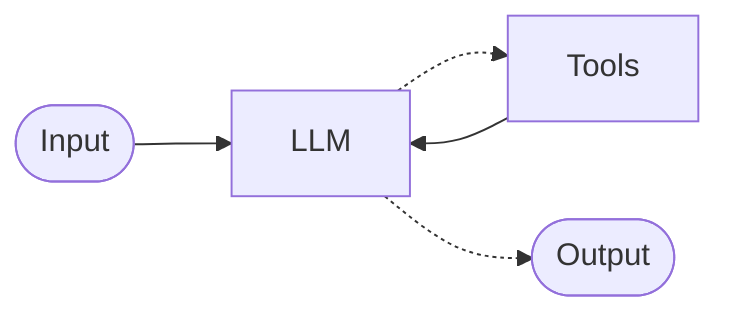

# Why Mounts Expand Agentic Capabilities

To understand the importance of mounts, we first need to reflect on the importance of tools.

Effective tool calling is the feature of LLMs that has enabled our agentic era. If having to compare the prose written by a pre-2025 LLM against that written by Claude Sonnet 3.7 — the model released in Feburary of 2025 alongside the research preview release of Claude Code — many of us would only be able to perceive marginal gains. But we all know Claude Sonnet 3.7 was a revolutionary model that helped propel Claude Code to define an entirely new class of products build around agents, and this is because its was *very good at using tools*.

This moment was one of the first big expantions of agentic capabilites for LLMs. These models were no longer just talkers, they were doers.

So it is with this understanding — `LLM + Tools = Agent` —  that we use to understand agents as some derivative of this basic form:

- LLM's have two output types, structured and non-structured. Structured output is really just code, and so we should let agents code.
- Environments should be built to produce predictable results to structured inputs not as a collection of tools.
