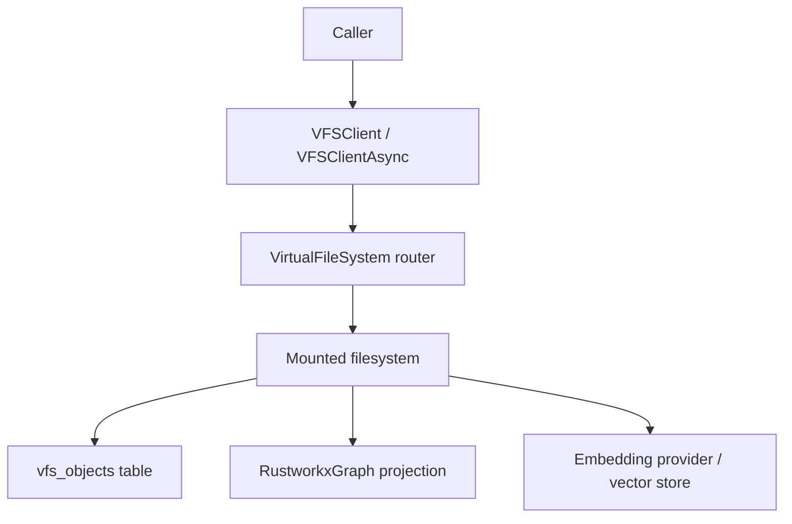
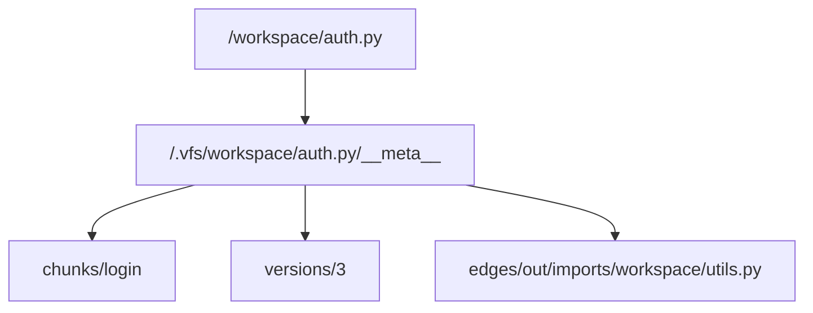
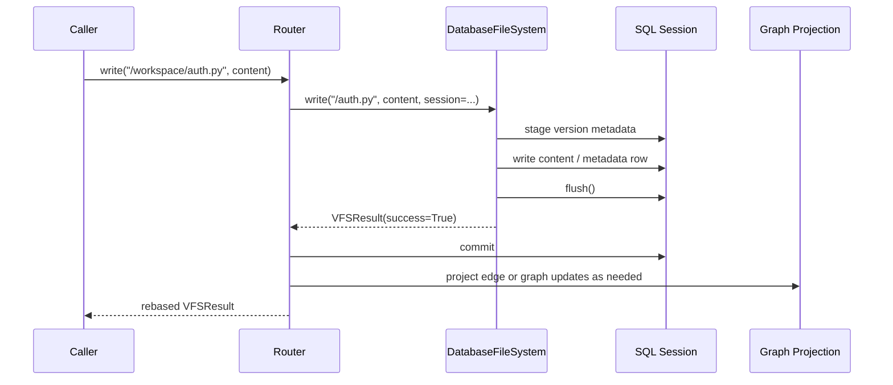

# Filesystem Architecture

## High-Level Flow

The client does not store user content itself. It routes each operation to the mounted filesystem that owns the path, then rebase-paths the returned `VFSResult`.

## Metadata Layout

Files, chunks, versions, and edges all share the same path vocabulary. That is why the graph, query engine, and storage layer compose cleanly.

## Write Path

The important invariant is content-before-commit. Backends never own the final commit; the router does.

## Backend Responsibilities

| Layer | Responsibility |
|------|----------------|
| `VirtualFileSystem` | Mount routing, session injection, result rebasing, fanout across mounts |
| `DatabaseFileSystem` | Portable CRUD, metadata semantics, SQL prefiltering, graph delegation |
| `PostgresFileSystem` | PostgreSQL-native grep, glob, lexical search, and pgvector search |
| `MSSQLFileSystem` | SQL Server-native grep, glob, and full-text search |
| `RustworkxGraph` | In-memory projection for traversal and ranking |

For the reasoning behind these boundaries, see [Architecture](architecture.md) and [Filesystem Internals](internals/fs.md).
