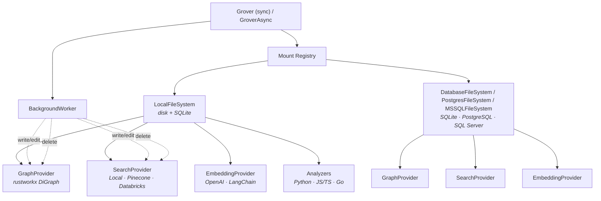

# Grover

**The agentic filesystem.** Safe file operations, knowledge graphs, and semantic search — unified for AI agents.

!!! warning "Alpha"
    Grover is under active development. The core API is functional and tested, but expect breaking changes before 1.0.

Grover gives AI agents a single toolkit for working with codebases and documents:

- **Versioned filesystem** — mount local directories or databases, write safely with automatic versioning, and recover mistakes with soft-delete trash and rollback.
- **Knowledge graph** — predecessor, successor, and containment queries powered by [rustworkx](https://github.com/Qiskit/rustworkx). Code is automatically analyzed (Python via AST; JS/TS/Go via tree-sitter) and wired into the graph.
- **Semantic search** — pluggable vector stores (local [usearch](https://github.com/unum-cloud/usearch), [Pinecone](https://www.pinecone.io/), [Databricks](https://docs.databricks.com/en/generative-ai/vector-search.html)) with pluggable embedding providers (OpenAI, LangChain). Search by meaning, not just keywords.

All three layers stay in sync — write a file and the graph rebuilds and embeddings re-index automatically.

The name comes from **grove** (a connected cluster of trees) + **rover** (an agent that explores). Grover treats your codebase as a grove of interconnected files and lets agents navigate it safely.

---

## Installation

```bash
pip install grover
```

Optional extras:

```bash
pip install grover[search]       # usearch (local vector search)
pip install grover[openai]       # OpenAI embeddings
pip install grover[pinecone]     # Pinecone vector store
pip install grover[databricks]   # Databricks Vector Search
pip install grover[treesitter]   # JS/TS/Go code analyzers
pip install grover[postgres]     # PostgreSQL backend
pip install grover[mssql]        # MSSQL backend
pip install grover[deepagents]   # deepagents/LangGraph integration
pip install grover[langchain]    # LangChain retriever + document loader
pip install grover[langgraph]    # LangGraph persistent store
pip install grover[all]          # everything
```

Requires Python 3.12+.

---

## Quick start

```python
from grover import Grover
from grover.fs import LocalFileSystem

# Create a Grover instance (state is stored in .grover/)
g = Grover()

# Mount a local project directory
backend = LocalFileSystem(workspace_dir="/path/to/project")
g.add_mount("/project", filesystem=backend)

# Write files — every write is automatically versioned
g.write("/project/hello.py", "def greet(name):\n    return f'Hello, {name}!'\n")
g.write("/project/main.py", "from hello import greet\nprint(greet('world'))\n")

# Read, edit, delete
content = g.read("/project/hello.py")
g.edit("/project/hello.py", "Hello", "Hi")
g.delete("/project/main.py")  # soft-delete — recoverable from trash

# Index the project (analyze code, build graph + search index)
stats = g.index()
# {"files_scanned": 42, "chunks_created": 187, "edges_added": 95}

# Knowledge graph queries
g.successors("/project/main.py")     # what does main.py depend on?
g.predecessors("/project/hello.py")  # what depends on hello.py?
g.contains("/project/hello.py")      # functions and classes inside

# Semantic search (requires embedding_provider + search_provider on add_mount)
# result = g.vector_search("greeting function", k=5)
# for candidate in result.file_candidates:
#     print(candidate.path)

# Persist and clean up
g.save()
g.close()
```

A full async API is also available:

```python
from grover import GroverAsync

g = GroverAsync()
await g.add_mount("/project", filesystem=backend)
await g.write("/project/hello.py", "...")
await g.save()
await g.close()
```

---

## Architecture

Grover is composed of three layers that share a common identity model — every node in the graph and every entry in the search index is a file path. All capabilities live as **providers** on the filesystem.



**Mount Registry** routes operations to the right backend based on mount paths. Multiple backends can be mounted simultaneously.

**Filesystem providers** live on each backend. `GraphProvider` maintains an in-memory directed graph. `SearchProvider` stores and searches vectors. `EmbeddingProvider` converts text to vectors. Code analyzers extract imports, functions, and class hierarchies automatically.

**BackgroundWorker** keeps everything consistent — when a file is written or deleted, the graph and search index update automatically.

---

## Backends

Grover supports three database-oriented backends through one public VFS contract:

**LocalFileSystem** — for desktop development and code editing. Files live on disk where your IDE, git, and other tools can see them. Metadata and version history are stored in a local SQLite database. This is the default for local projects.

**DatabaseFileSystem** — the portable SQL backend. All content lives in `vfs_objects`, and search uses the cross-dialect baseline path.

**PostgresFileSystem** — the PostgreSQL-native backend. `lexical_search`, `grep`, and `glob` run in Postgres, and pgvector is the default vector path when the mounted model declares a native `embedding` column. Passing `vector_store=` still overrides pgvector for vector and semantic search.
Legacy Postgres tables that still store `embedding` as serialized text must be migrated explicitly: add a new `vector(<N>)` column, backfill from the old `embedding` values, swap the columns, then create the ANN index on the native column. Runtime initialization and schema verification do not rewrite the column in place.

**MSSQLFileSystem** — the SQL Server / Azure SQL native backend with full-text and regex pushdown.

All three support the same public VFS API, versioning, and trash. You can mount them side by side:

```python
from grover import EngineConfig
from grover.backends import LocalFileSystem

g = Grover()

# Local code on disk
g.add_mount("/code", filesystem=LocalFileSystem(workspace_dir="./my-project"))

# Shared docs in PostgreSQL
g.add_mount("/docs", engine_config=EngineConfig(url="postgresql+asyncpg://localhost/mydb"))
```

---

## What's in `.grover/`

When you use Grover, a `.grover/` directory is created to store internal state:

| Path | Contents |
|------|----------|
| `grover.db` | SQLite database with file metadata, version history, graph edges, and extracted code chunks |
| `search.usearch` | The HNSW vector index for semantic search |
| `search_meta.json` | Metadata mapping for the search index |

This directory is excluded from indexing automatically. You'll typically want to add `.grover/` to your `.gitignore`.

---

## API overview

The full API reference is in the [API Reference](api.md). Here's a summary:

| Category | Methods |
|----------|---------|
| **Filesystem** | `read`, `write`, `edit`, `delete`, `list_dir`, `exists`, `move`, `copy` |
| **Search / Query** | `glob`, `grep`, `tree` |
| **Versioning** | `list_versions`, `get_version_content`, `restore_version` |
| **Trash** | `list_trash`, `restore_from_trash`, `empty_trash` |
| **Graph** | `successors`, `predecessors`, `path_between`, `contains` |
| **Search** | `vector_search`, `lexical_search`, `hybrid_search`, `search` |
| **Lifecycle** | `add_mount`, `unmount`, `index`, `save`, `close` |

Key types:

```python
from grover import Ref, FileSearchResult, FileCandidate

# Ref — immutable identity for any Grover entity
Ref(path="/project/hello.py")                              # file
Ref.for_chunk("/project/hello.py", "greet")                # chunk
Ref.for_version("/project/hello.py", 3)                    # version
Ref.for_connection("/a.py", "/b.py", "imports")            # connection

# FileSearchResult — search results with evidence-backed candidates
result = g.search("greeting function", k=5)
result.success           # bool
result.file_candidates   # list[FileCandidate]
candidate = result.file_candidates[0]
candidate.path           # str — file path
candidate.evidence       # list[Evidence] — why this path matched
```

---

## Roadmap

Grover is in its first release cycle. Here's what's coming:

- **MCP server** — expose Grover as a Model Context Protocol server for Claude Code, Cursor, and other MCP-compatible agents
- **CLI** — `grover init`, `grover status`, `grover search`, `grover rollback`
- **More framework integrations** — Aider plugin, fsspec adapter
- **More language analyzers** — Rust, Java, C#
- **More embedding providers** — Cohere, Voyage (OpenAI and LangChain adapters are already available)

---

## License

[Apache-2.0](https://github.com/ClayGendron/grover/blob/main/LICENSE)
