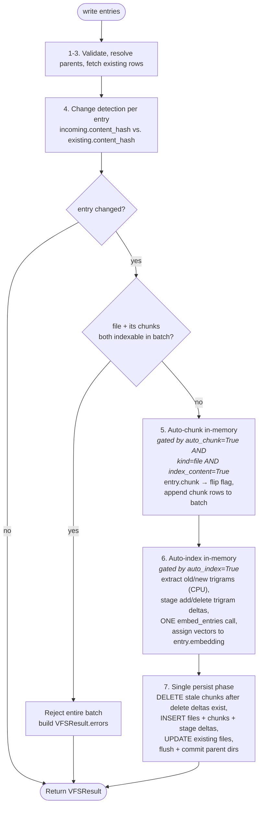
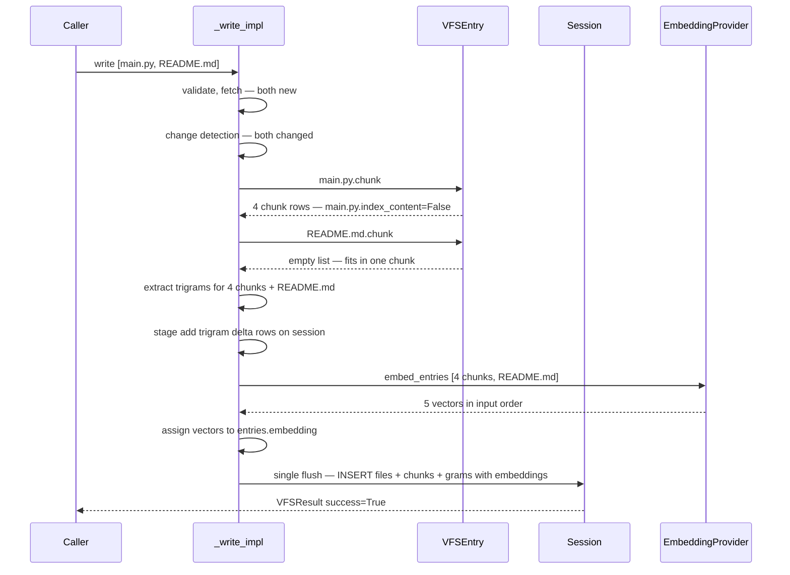

# Write Pipeline

This page documents the full lifecycle of a `write()` call against `DatabaseFileSystem` and its subclasses, including the auto-chunking and auto-indexing maintenance steps introduced in story 014.

The pipeline is **single-transaction** — when `write()` returns success with the default flags on, the database is queryable end-to-end without any follow-up maintenance call.

## TL;DR

```python
fs = PostgresFileSystem(engine=engine)            # auto_chunk=True, auto_index=True

await fs.write([
    VFSEntry(path="/repo/main.py", content=src),  # 8 KB → chunked
    VFSEntry(path="/repo/README.md", content=md), # short → not chunked
])
# After this call:
#   - main.py exists (index_content=False), with 4 chunk rows under
#     /repo/main.py/__meta__/chunks/* (each index_content=True)
#   - README.md exists (index_content=True), no chunks
#   - Trigrams + embeddings exist for the 4 chunks and for README.md
#   - All in one transaction. One embedding-provider call.
```

## End-to-End Flow



## Stage-By-Stage

### 1–3. Validate, parent dirs, fetch

These stages are unchanged from the existing `_write_impl`:

- Reject root writes, invalid paths, and unknown kinds.
- Verify chunk parents — chunk rows whose owner file is not in the database must include that file in the same batch.
- Resolve and (if needed) revive ancestor directories.
- Batch-fetch existing rows by path, plus the latest version row's `content_hash` for each existing file.

The next stages in the pipeline operate on the fetched rows. By this point we know, for every incoming entry, whether a row at that path already exists and what its current `content_hash` is.

### 4. Change detection

Change detection runs **per entry, not per batch**. A single `write()` call can mix changed and unchanged entries; each one independently picks its branch through the rest of the pipeline.

Compare `incoming.content_hash` (already computed by the model validator) against `existing.content_hash`:

| Case | `changed?` | What runs for this entry |
|---|---|---|
| New path (no existing row) | `True` | Insert + chunking + indexing (subject to flags) |
| Existing path, hashes equal | `False` | **No-op.** No version row, no chunk cascade, no trigrams, no embedding, *and no `updated_at` refresh* — the row is untouched |
| Existing path, hashes differ | `True` | Version row cut, chunk cascade, indexes refresh (subject to flags) |

Two consequences of running this per entry:

- **Unchanged writes are completely free.** A re-run of an ingestion pipeline over the same content writes nothing. No version rows, no chunk delete/insert, no trigram inserts, no embedding-provider calls, no `UPDATE` on the row itself. `updated_at` reflects the last *real* content change, which makes it a reliable signal for downstream change-detection consumers.
- **Mixed batches do the minimum work.** A `write()` of 100 files where only 3 changed will only chunk and index those 3. The other 97 take the no-op path and never reach step 5 or step 7.

The "changed" diamond in the flow chart above is evaluated once per entry. Every branch downstream of it (`AutoChunkOn`, `Persist`, `AutoIndexOn`) joins back into the same shared steps because the session, transaction, and bulk embedding call are batch-level — but the *decision* about whether each entry contributes to chunking, trigrams, or the embedding bulk list is local to that entry.

### 5. Auto-chunk (when `auto_chunk` is on, in-memory only)

For every file in the batch where `kind == "file"` and `index_content is True` and the content changed:

1. **Conflict check (batch-fatal).** If the same batch contains *any* file with `index_content is True` whose path also has pre-built chunk rows in the batch, **the whole batch is rejected** before any other auto-chunk or auto-index work runs:
   ```text
   Cannot auto-chunk file '/repo/main.py' because the same write
   batch already provides chunks for it. Either set index_content=False
   on the file, configure this filesystem with auto_chunk=False, or omit the
   pre-built chunk rows. Resubmit the batch after resolving — no
   entries from this batch were written.
   ```
   The check runs as a single batch-level pass before step 5a, so the call returns before any DB mutation. Rationale: this conflict is almost always a pipeline bug (the caller intended either auto-chunk *or* pre-built chunks, not both). Letting unrelated entries through hides the bug and risks an inconsistent half-committed batch. Failing the whole batch surfaces the bug immediately.
2. **Call `entry.chunk()`.** The model splits via `split_content` (default: recursive 2 KB / 256 B overlap; override on a subclass for tree-sitter or token-aware chunkers). On success it mutates `entry.index_content = False` and returns the new chunk rows. When the content fits in one chunk, it returns `[]` and leaves the flag alone.
3. **Append.** The new chunk rows are appended to the in-memory write batch.

This stage is **purely in-memory**. No database mutations happen yet. The cascade `DELETE` for existing chunks of re-chunked files is staged for the persist phase (step 7), not issued here.

After this stage, the in-memory batch contains exactly the rows that should be persisted: the file row (with `index_content` cleared if it was chunked), the new chunk rows, and any non-file entries the caller included.

### 6. Auto-index (when `auto_index` is on, in-memory + provider call)

Auto-index runs **before** the database write. By the end of this stage the in-memory entries carry every value that needs to be written: trigram delta rows exist on the session, vectors are assigned to `entry.embedding`. The single persist phase in step 7 then writes everything in one shot.

#### 6a. Extract trigrams (pure CPU)

For every entry where `index_content is True` and content changed, run the code-gram tokenizer (story 013) over both the old content and the new content when old content exists:

- New entry: `adds = new_grams`
- Existing edited entry: `adds = new_grams - old_grams`; `deletes = old_grams - new_grams`
- Entry that stops being indexable, for example a file flipped to `index_content=False` because chunks now carry the index: `deletes = old_grams`

This step is pure-CPU and makes no DB or network calls. The point is to stage only the index facts that changed, not to reinsert every unchanged trigram.

#### 6b. Stage trigram delta rows

Materialize the extracted changes as staging rows with an action flag:

```python
session.add_all(
    self._model_gram_stage(
        entry_id=entry.id,
        gram_kind=kind,
        gram_key=key,
        action="add",  # or "delete"
    )
    for entry in changed_indexable_entries
    for (kind, key, action) in gram_deltas_for(entry)
)
```

`session.add_all` is in-memory — SQLAlchemy queues the rows in the unit of work. No `INSERT` is issued yet; that happens at the persist flush in step 7.

For the row-store MVP, the backend may apply these deltas directly to `vfs_entry_chunk_grams` by deleting removed grams and inserting added grams. For the full posting-list adapter, these rows remain in the staging table until they are flushed or compacted into compressed posting blocks.

Staging rows are interpreted with **latest action wins** per `(gram_kind, gram_key, entry_id)`. This matters when a file changes more than once before compaction. If an older pending row says `delete` and a newer pending row says `add` for the same trigram and entry, the newer `add` is the current truth.

#### 6c–e. Bulk embed in one provider call

The base class never calls the embedding provider once per entry. Instead it:

1. **Collects** every entry that needs an embedding — `index_content is True`, content changed, no caller-provided `embedding` (caller-provided values win, tracked via `_explicit_fields`).
2. **Issues one bulk call:**
   ```python
   vectors = await provider.embed_entries(entries_needing_embeddings)
   ```
3. **Assigns** vectors to `entry.embedding` in memory. The values ride along when the entry is `INSERT`ed (or `UPDATE`d) at the persist flush in step 7.

The `EmbeddingProvider` Protocol is:

```python
class EmbeddingProvider(Protocol):
    async def embed_entries(
        self,
        entries: Sequence[VFSEntry],
    ) -> Sequence[Vector]:
        """Return one vector per input entry, in input order."""
```

The provider is free to send the whole list to the upstream API in one HTTP request, sub-batch by token budget / rate limit, or serialize to one-at-a-time as a fallback. The VFS does not assume how the work is sharded — only that input order is preserved on output. Retries and backoff live inside a single `embed_entries` call, not across calls.

This collapses N round-trips into 1 per write. Because the embedding call happens **before** any database write, a provider failure aborts the whole pipeline cleanly: nothing has been INSERTed or UPDATEd, so there is no partial state to roll back beyond the in-memory batch the caller already knows about.

### 7. Single persist phase

This is the only stage that writes to the database. It runs once, executes a single batch of mutations, and ends in a single `await session.flush()`. Composition:

1. **Stage delete deltas before content disappears.** For *existing* files whose content changed and that were re-chunked in step 5, compute delete deltas for the old indexable rows before deleting their old chunks. This matters because permanent deletes and chunk cascades remove the content needed to recalculate trigrams.
2. **DELETE stale chunks (cascade).** Delete pre-existing chunk rows under `'/path/__meta__/chunks/%'` only after the delete deltas for those old chunks have been staged.
3. **Clear stale embeddings.** For files whose `index_content` flipped from `True` → `False` in step 5, clear the file row's embedding and stage delete deltas for its old file-level trigrams. The new chunks carry the replacement trigram add rows and embeddings.
4. **Version cuts.** Existing files get a new version row via `plan_file_write` (existing pipeline).
5. **INSERT new rows.** All file rows, chunk rows, and trigram staging rows hit the database in one batched `INSERT`.
6. **UPDATE existing rows.** Existing files whose content changed (and who already have a row) get their content, hash, version pointer, and pre-computed `embedding` updated in a single `UPDATE` per entry.
7. **Commit parent dirs.** Newly created or revived ancestor directories are added to the session.
8. **Flush.** `await session.flush()` issues all of the above in one round-trip.

After the flush, the posting-list adapter checks the staging-table size. If pending staging rows exceed `5_000_000`, it requests a posting-list flush. The request does not have to rebuild the compressed index inside the user write transaction; grep stays correct because it reads compressed posting blocks plus unflushed staging adds, then subtracts unflushed staging deletes.

The session's transaction is still owned by the caller / router (per the content-before-commit invariant); `_write_impl` never commits. If the caller's enclosing transaction rolls back, every mutation in this phase rolls back together.

The key property of pre-persist indexing: **embeddings and trigram deltas are written atomically with the rows they describe.** There is no second `UPDATE` to back-fill `embedding` after the row exists, and no follow-up maintenance call is required for grep correctness. Compression can lag behind because search consults both the compressed posting lists and pending staging deltas.

### Delete indexing

Deletes use the same delta staging model. Before `_delete_impl` soft-deletes or permanently deletes an `index_content=True` row, it recalculates that row's current trigrams and stages one `action="delete"` row for each distinct trigram. If a deleted file owns indexable chunks, the backend recalculates delete trigrams for the chunks, because those chunks are the rows that actually carried the index.

Search then evaluates:

```text
compressed posting lists
+ latest staging rows where action = add
- latest staging rows where action = delete
```

That makes deletes visible immediately without rewriting every compressed posting block on the write path. Later, when a posting-list flush or compaction touches a gram, it applies the staged delete rows by leaving those entry ids out of the rebuilt compressed block. Delete staging rows can be marked applied only after every active block that could contain that `(gram, entry_id)` has been rewritten or retired.

## Failure Semantics

`write()` does not raise for user-correctable problems. Instead it returns `VFSResult(success=False, candidates=[], errors=[...])`. The `errors` list carries human-readable messages with the offending path(s); `candidates` is empty because — by the "candidates = in the database" contract — nothing was written.

| Failure | Stage | Effect |
|---|---|---|
| File-and-chunks conflict | 5 (pre-check) | `errors` carries one entry naming the offending file. No DB mutation. |
| Auto-chunk runtime error (e.g. `split_content` raises) | 5 | `errors` carries the exception message and offending path. No DB mutation. |
| Trigram extraction error | 6a | `errors` carries the exception. Nothing to roll back. |
| Embedding provider error (any sub-batch fails) | 6d | `errors` carries the provider exception. Nothing to roll back. |
| Persist flush error (constraint violation, deadlock, etc.) | 7 | Transaction rolls back: no file rows, no chunk rows, no trigram staging rows, no embedding updates persist. `errors` carries the underlying SQL error. Computed vectors discarded. |

Programmer errors (genuinely broken state — corrupt model, unusable session) are still raised as exceptions. `write()` catches and converts the *expected* failure modes, not all of Python.

There is no window where a file row exists with `index_content = False` but its chunks have not been inserted. There is no window where chunks exist with `index_content = True` but their trigram deltas have not been staged (with `auto_index=True`). And there is no window where a file row has been written but its embedding has not — the two are written in the same statement.

## Multi-Mount Writes

Everything above describes one mount's `_write_impl`. The user-facing `VFSClient.write()` is the router — it groups the input batch by which mount owns each path, then calls each mount's `_write_impl` independently. Each mount has its own session, its own transaction, and runs the full pipeline on its slice of the batch.

The contract:

- **Per-mount atomicity is preserved.** A mount either commits its slice cleanly or rolls it back; no half-committed mount is observable.
- **Cross-mount atomicity is NOT provided.** vfs does not implement two-phase commit across heterogeneous backends — a Postgres mount and an MSSQL mount cannot share a transaction. If mount A succeeds and mount B fails, A's writes are committed and B's writes never happened.

The router merges per-mount results into one `VFSResult`:

- `candidates` — flattened union of every mount's candidates.
- `errors` — flattened union of every mount's errors; messages may be prefixed with the mount name.
- `success` — `not errors`. `False` if any mount errored.

A mixed outcome yields `success=False` AND non-empty `candidates`. The "candidates = in the database" contract still holds — those rows ARE in their respective mount's database. `to_str()` emits the `write errors:` block first and the `write success:` block second; the presence of both blocks in the same output is the partial-commit signal:

```text
write errors:
  /docs/notes.md: pgvector dimension mismatch (mssql_docs)

write success: 2 files, 6 chunks written
```

The caller is responsible for deciding what to do — retry the failed mount, surface to a human, or accept the partial state. vfs does not roll back the successful mounts because (a) it can't without a distributed transaction, and (b) doing so would require speculative writes that violate the content-before-commit invariant.

If you need cross-mount atomicity, split your writes per mount and handle reconciliation yourself.

## The `write()` Signature

Entries are the primary input — the first positional argument:

```python
async def write(
    self,
    entries: Sequence[VFSEntry] | None = None,
    *,
    path: str | None = None,
    content: str | None = None,
    overwrite: bool = True,
    user_id: str | None = None,
) -> VFSResult: ...
```

Two call shapes:

```python
# 1. Batch of entries (the primary path) — positional list, no kwarg needed
await fs.write([entry_a, entry_b])

# 2. Single path + content (the convenience path) — keyword only
await fs.write(path="/foo.txt", content="hello")
```

`path` and `content` are keyword-only because they only make sense together and would otherwise compete with `entries` for the first slot. Existing callers that use `entries=[...]` as a kwarg keep working — the parameter is just no longer kwarg-only.

## The Return Value

`write()` returns a `VFSResult` and never raises for user-correctable problems. Two pieces of contract:

```python
class Candidate:
    path: str
    kind: str          # "file" | "chunk" | "version" | "edge" | "directory"
    status: Literal["created", "updated", "unchanged"] | None
    # ...other fields unchanged

class VFSResult:
    function: str
    success: bool      # equivalent to: not errors
    candidates: list[Candidate]
    errors: list[str]

    def __str__(self) -> str:
        return self.to_str()

    def to_str(self) -> str: ...
```

**Candidates mean "this row is now in the database."** The `status` field has exactly three values:

- `created` — new row inserted by this call
- `updated` — existing row whose content changed
- `unchanged` — existing row, hash matched, no DB write happened (file row only — pre-existing chunks and versions are not pulled into the result for unchanged files)

On a successful `write()` the candidates list contains every row the persist phase touched: file rows, newly-created chunk rows (status=`created`), newly-cut version rows (status=`created`), plus any unchanged file rows. There is no `rejected` status — if a row didn't get written, it isn't in `candidates`.

**Errors mean "this didn't happen."** When any error fires, the affected entries do not appear in `candidates` at all. `errors` carries the path(s) and reason. `success` is `not errors`.

At the **per-mount** level the result is binary — either the write went through and you have candidates, or it didn't and you have errors. At the **multi-mount router** level (see [Multi-Mount Writes](#multi-mount-writes) below) `candidates` and `errors` can both be non-empty in the same result. That signals partial commit across mounts.

Because `__str__` delegates to `to_str()`, the common consumption patterns are one-liners:

```python
print(await fs.write([entry]))         # tool-call output
return str(await fs.write([entry]))     # return to model
await fs.write([entry])                 # fire-and-forget
result = await fs.write([entry])        # explicit branching
if not result.success: ...
```

**Output format.** The formatter never uses the word "candidates" in its output. Up to two blocks, each optional:

- `write errors:` — one line per error, formatted `<path>: <reason>`. Rendered first when present.
- `write success: <kind counts>` — counts aggregated by displayable write kinds only: files, chunks, and edges. Version rows are never included in the success summary. For a single-file batch, a status-verb path line appears below the summary; multi-file batches show counts only.

Empty result renders `write: nothing to do`. The four shapes:

```text
# Empty
write: nothing to do
```

```text
# Single-entry success
write success: 1 file, 4 chunks written

  created /repo/main.py
```

```text
# Multi-entry success
write success: 3 files, 6 chunks written
```

```text
# Errors only
write errors:
  /repo/auth.py: file + chunks both in batch with index_content=True
```

```text
# Mixed (multi-mount partial commit) — errors first, then success
write errors:
  /docs/notes.md: pgvector dimension mismatch (mssql_docs)

write success: 2 files, 6 chunks written
```

Counts come from walking `result.candidates`, filtering to `kind in {"file", "chunk", "edge"}`, and grouping by `kind`. A status breakdown (`1 created, 1 updated, 1 unchanged`) is appended after the file count when the batch contains a mix; pure single-status batches omit it. Version rows may exist in `result.candidates` for programmatic inspection, but they are hidden from the human write summary.

## Constructor Flags

`auto_chunk` and `auto_index` are filesystem-level settings, configured on `DatabaseFileSystem` construction. They are not accepted by `write()`.

```python
fs = PostgresFileSystem(engine=engine, auto_chunk=False, auto_index=False)
await fs.write(large_batch)
```

This is the recommended shape for batch ingestion pipelines that prefer to build indexes once at the end of a load, rather than amortized across every write.

## Worked Examples

### A — Pipeline ingest, defaults on

```python
await fs.write([
    VFSEntry(path="/repo/main.py", content=src_8k),
    VFSEntry(path="/repo/README.md", content=md_short),
])
```



One transaction. One embedding call. Five vectors returned.

`result.to_str()` yields:

```text
write success: 2 files, 4 chunks written
```

`result.candidates` contains the `main.py` file row, its 4 chunk rows (each status=`created`), and the `README.md` file row (status=`created`). Multi-file batches show counts only — walk `result.candidates` for path-level detail when you need it.

### B — Re-write with new content

```python
await fs.write([
    VFSEntry(path="/repo/main.py", content=src_8k_v2),
])
```

- Hash differs from stored → `changed = True`.
- In-memory: `main.py.chunk()` produces fresh chunks. Trigrams extracted for the new chunks. One bulk `embed_entries` call returns vectors for them.
- Persist phase issues, in one flush:
    - Stage delete trigram delta rows for the old chunks, then `DELETE` old chunks under `/repo/main.py/__meta__/chunks/*`.
    - Version row for the previous content (existing pipeline).
    - `INSERT` new chunk rows + their trigram staging rows + their embeddings in one batch.
    - `UPDATE` `main.py` with the new content, hash, and `index_content = False`.
- All in one transaction. One embedding-provider call. One flush.

`result.to_str()` yields:

```text
write success: 1 file, 4 chunks written

  updated /repo/main.py
```

The deleted-then-recreated chunks appear as fresh `created` candidates; the previous chunks aren't surfaced (they were deleted, not "in the database"). A version row may be present in `result.candidates`, but it is not counted in the human success summary. Single-file batches include the path line below the summary.

### C — Same content re-written

```python
await fs.write([
    VFSEntry(path="/repo/main.py", content=src_8k),  # identical
])
```

- Hash equal → no-op. No version row, no chunk cascade, no trigram work, no embedding call, no `UPDATE` on the file row, no `updated_at` refresh.
- Cost is one fetch and zero writes.
- `updated_at` continues to reflect the last *real* content change, so consumers downstream can use it as a reliable change signal.

`result.to_str()` yields:

```text
write success: 1 file written

  unchanged /repo/main.py
```

The candidate has `status="unchanged"`; pre-existing chunks and versions are not surfaced (they didn't change either), so the summary doesn't mention them.

### D — Caller pre-builds chunks

```python
file = VFSEntry(path="/repo/main.py", content=src_8k)
chunks = file.chunk()              # mutates file.index_content=False
await fs.write([file, *chunks])    # auto_chunk sees flag is already False
```

- Auto-chunk does nothing (file's flag is already `False`).
- Auto-index runs against the chunks (each `index_content=True`).
- Same end state as Example A.

### E — Pre-built chunks but flag still set

```python
file = VFSEntry(path="/repo/main.py", content=src_8k, index_content=True)
chunks = [VFSEntry(path="/repo/main.py/__meta__/chunks/...", ...), ...]
await fs.write([file, *chunks])
```

- Conflict check fires before any DB write: file with `index_content=True` and chunks for the same file are both in the batch.
- Returns `VFSResult(success=False, candidates=[], errors=[...])`. Neither the file nor the chunks persist.
- `result.to_str()` yields:
  ```text
  write errors:
    /repo/main.py: file + chunks both in batch with index_content=True
  ```
- Remediation: set `index_content=False` on the file, omit the pre-built chunks, or use a filesystem configured with `auto_chunk=False`, then resubmit.

### F — Bulk import with deferred indexing

```python
fs = PostgresFileSystem(engine=engine, auto_chunk=False, auto_index=False)
await fs.write(large_batch)
```

- Pipeline ingests raw rows fast. No chunking, no trigrams, no embedding calls.
- A separate maintenance pass (future story) rebuilds indexes once the load is done.

### G — Multi-mount partial commit

```python
client = VFSClient()
client.add_mount("workspace", PostgresFileSystem(engine=pg_engine))
client.add_mount("docs", MSSQLFileSystem(engine=mssql_engine))

await client.write([
    VFSEntry(path="/workspace/a.py", content=src_a),
    VFSEntry(path="/workspace/b.py", content=src_b),
    VFSEntry(path="/docs/notes.md", content=md_with_bad_embedding_dim),
])
```

- Router groups by mount: workspace gets `[a.py, b.py]`; docs gets `[notes.md]`.
- Workspace runs the full pipeline and commits cleanly.
- Docs hits an embedding dimension mismatch on persist flush — `success=False, candidates=[], errors=[...]` for that mount.
- **Workspace's transaction is already committed.** vfs does not roll it back.
- The merged `VFSResult` carries workspace's candidates *and* docs' errors.

`result.to_str()` yields:

```text
write errors:
  /docs/notes.md: pgvector dimension mismatch (mssql_docs)

write success: 2 files, 6 chunks written
```

Errors come first so a scanning agent sees the actionable items before the success summary. The presence of both blocks in the same output is the partial-commit signal — the caller is responsible for the next step (retry the failed mount, surface to a human, or accept the partial state).

## When to Turn the Flags Off

| Workload | Recommended setting |
|---|---|
| Interactive editing, agent loops, single-file writes | `auto_chunk=True, auto_index=True` (defaults) |
| Bulk repo ingest, then query | Construct the filesystem with `auto_chunk=False, auto_index=False`, then run a maintenance pass |
| Pre-computed embeddings (e.g. replicating from another store) | Defaults on; auto-index respects caller-provided embeddings |
| Custom chunker (tree-sitter, semantic) | Override `VFSEntry.split_content` on a subclass; defaults on |

## See Also

- [Filesystem Architecture](../fs_architecture.md) — high-level component diagram and metadata layout
- [Filesystem Internals](fs.md) — backend responsibilities and the router contract
- Story 013 — code-gram tokenizer and trigram index
- Story 014 — auto-chunk and auto-index on write (this pipeline)
