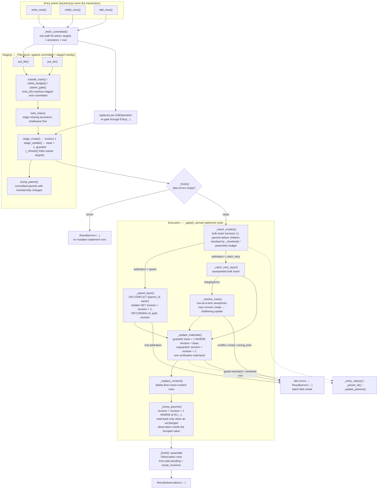

# Database write pipeline

Plan-then-execute flow in `src/vfs/storage/backends/database/writes.py`. The
three public builders share one shape: fetch committed state, stage against a
`_Plan` overlay, then hand an error-free plan to `_finish` → `_apply`, which
runs the pinned bulk-statement sequence. Revisions are per-entry monotone:
creates mint 1, guarded updates write base + 1, clobbers and parent bumps
increment SQL-side (`revision = revision + 1`).

